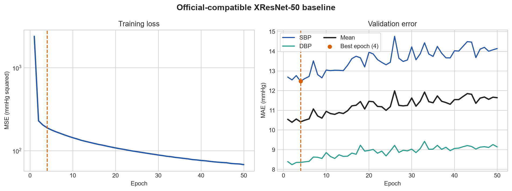

# Official-Compatible XResNet-50 Baseline

## Run

| Item | Value |
|---|---|
| Model | QUMPHY-compatible XResNet-50 (1-D) |
| Trainable parameters | 886,690 |
| Input | 10 s filtered PPG, 125 Hz |
| Protocol | Subject-disjoint, calibration-free |
| Train / validation / test windows | 412,920 / 52,560 / 57,600 |
| Epochs | 50 |
| Best epoch | 4 (validation SBP MAE) |
| Hardware | NVIDIA GeForce RTX 4060 Laptop GPU |
| Runtime | 2 h 24 min 23 s |

The model topology, initialization, head, and parameter count match the
upstream QUMPHY XResNet1d50 implementation. Training used a physical batch size
of 512, AdamW with a learning rate of 0.001 and weight decay of 0.001, dropout
of 0.5, mixed precision, and MSE on unstandardized SBP/DBP targets.

## Test metrics

| Predictor | SBP MAE | SBP RMSE | DBP MAE | DBP RMSE | Mean MAE |
|---|---:|---:|---:|---:|---:|
| Train-set mean | 14.94 | 18.72 | 9.43 | 11.87 | 12.19 |
| **XResNet-50** | **12.49** | **16.02** | **8.06** | **10.18** | **10.28** |

All values are in mmHg. XResNet-50 reduced mean MAE by 15.7% relative to the
train-set mean predictor.

| Target | Bias | Error SD |
|---|---:|---:|
| SBP | -1.61 | 15.94 |
| DBP | -1.63 | 10.05 |

## Training behavior

Validation error was lowest near the beginning of training even though
training MSE continued to decrease. The best checkpoint was therefore selected
at epoch 4 instead of using the final epoch.

## Reference comparison

The published calibration-free VitalDB result for XResNet1d50 is 12.40 mmHg
SBP MAE and 7.84 mmHg DBP MAE. This reproduction is 0.09 mmHg higher for SBP
and 0.22 mmHg higher for DBP.

The upstream split-generation script randomly selects validation and
calibration subjects but does not publish a random seed. This run therefore
uses the repository's deterministic subject-disjoint validation holdout. The
official calibration-free test subset is unchanged.

Reference: [Generalizable deep learning for cuffless blood pressure estimation
using photoplethysmography](https://pmc.ncbi.nlm.nih.gov/articles/PMC12435175/)

## Files

- `summary.json`: compact machine-readable run summary.
- `history.json`: per-epoch training and validation metrics.
- `training_curves.png`: training-loss and validation-MAE curves.

PulseDB arrays and model checkpoints remain local and are not tracked by Git.
