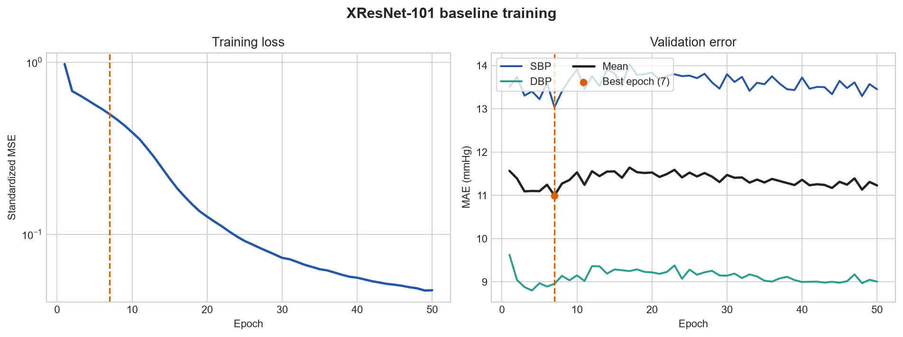

# XResNet-101 VitalDB Calibration-Free Baseline

## Run

| Item | Value |
|---|---|
| Model | XResNet-101 (1-D) |
| Input | 10 s PPG, 125 Hz |
| Protocol | Subject-disjoint, calibration-free |
| Train / validation / test windows | 412,920 / 52,560 / 57,600 |
| Epochs | 50 |
| Best epoch | 7 |
| Hardware | NVIDIA GeForce RTX 4060 Laptop GPU |
| Runtime | 9 h 26 min 52 s |

The checkpoint with the lowest validation mean MAE was selected. Test metrics
were computed from that checkpoint after training.

## Test metrics

| Predictor | SBP MAE | SBP RMSE | DBP MAE | DBP RMSE | Mean MAE |
|---|---:|---:|---:|---:|---:|
| Train-set mean | 14.94 | 18.72 | 9.43 | 11.87 | 12.19 |
| XResNet-101 | **13.46** | **17.12** | **8.55** | **10.85** | **11.00** |

All values are in mmHg. The XResNet-101 reduced mean MAE by 9.7% relative to
the train-set mean predictor.

| Target | Bias | Error SD |
|---|---:|---:|
| SBP | -0.64 | 17.11 |
| DBP | -0.50 | 10.84 |

## Training behavior

Training MSE continued to fall after epoch 7 while validation MAE stopped
improving. This gap indicates overfitting and motivates early stopping,
learning-rate scheduling, and additional regularization in subsequent runs.

The training loss is MSE on standardized targets and is therefore not measured
in mmHg. Validation and test MAE are the main performance measures.

## Reference comparison

The published calibration-free VitalDB result for XResNet1d101 is 12.70 mmHg
SBP MAE and 8.05 mmHg DBP MAE. This independent implementation is 0.76 mmHg
higher for SBP and 0.50 mmHg higher for DBP. Differences in implementation,
normalization, optimization, and validation splitting remain to be audited
before modifying the baseline architecture.

Reference: [Generalizable deep learning for cuffless blood pressure estimation
using photoplethysmography](https://pmc.ncbi.nlm.nih.gov/articles/PMC12435175/)

## Files

- `summary.json`: compact machine-readable run summary.
- `history.json`: per-epoch training and validation metrics.
- `training_curves.png`: training-loss and validation-MAE curves.

Model checkpoints and the PulseDB arrays remain local and are not tracked by
Git.
